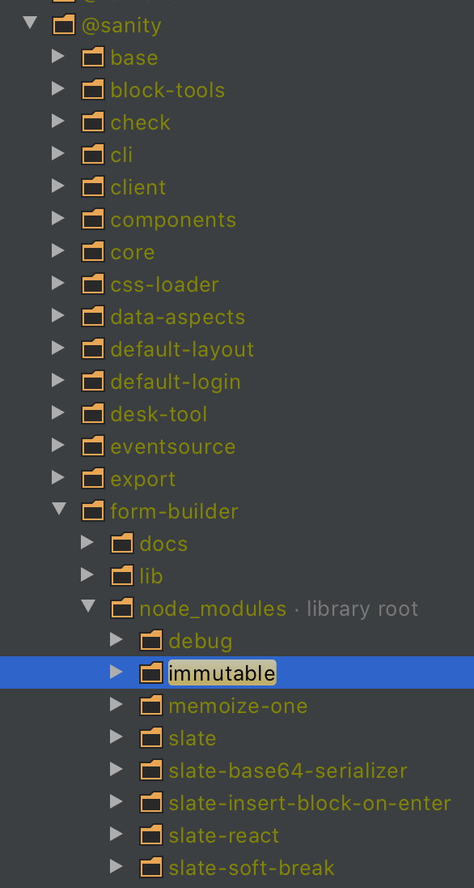
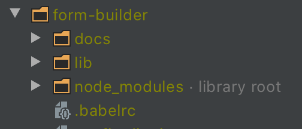

# Resolved: this issue can no longer be reproduced

This issue was resolved by upgrading Sanity Studio to version 1.150.1

# Reproduction repo
This repo reproduces hoisting issue with slate and yarn workspaces.

The issue seems to stem from sanity/slate expecting some packages to be hoisted to the top-level node_modules.  
Apparently that is not a valid assumption when using yarn workspaces.

Default result from `yarn install` when using workspaces. Here some slate dependencies lie inside @sanity/form-builder package's node_modules.



## Reproduction
```sh
# initial install
yarn

# build fails
yarn reproduce
```

## Workaround
The workaround is to hoist "immutable" to the root node_modules by adding the package to the resolutions in package.json, see code snippet below.  
See the branch named "workaround" for working example.

This is however a workaround, and ideally the dependencies should be found without hoisting.

```
# package.json
  "resolutions": {
    "immutable": "3.8.2"
  }
```

Result from `yarn install` after adding a resolution for "immutable". Here all slate dependencies (and immutable) lie in the top-level node_modules.

